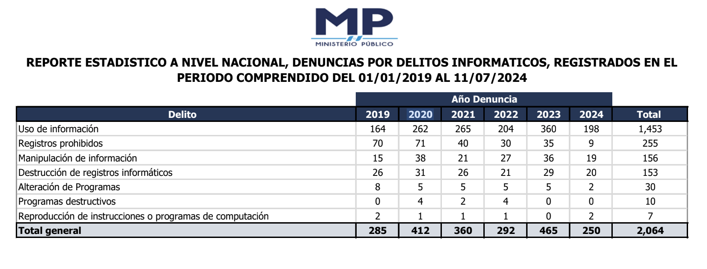

## Un panorama general del cibercrimen en Guatemala.
Un fenómeno alarmante ha surgido en Guatemala en los últimos años: el aumento del delito cibernético. Las amenazas digitales aumentan a medida que la tecnología avanza y se convierte en una parte fundamental de nuestras vidas. Todos, desde pequeños negocios hasta ciudadanos comunes, están afectados por este tipo de delito, no solo las grandes corporaciones o las instituciones financieras. Esta realidad está demostrada por los datos más recientes del Ministerio Público, que muestran un incremento constante en las denuncias por delitos informáticos. Como la seguridad digital se ha vuelto tan importante como la seguridad física, es un llamado de alerta para todos nosotros.

## Principales Tipos de Cibercrimen en Guatemala
El cibercrimen adopta diversas formas, y en Guatemala, algunas de las más comunes son:

- **Uso de Información:** Este es el delito informático más frecuente en el país, con 1,453 denuncias registradas entre 2019 y 2024. Aquí estamos hablando de casos donde los delincuentes acceden a información personal o empresarial sin permiso, ya sea para explotarla, venderla o usarla para otros delitos.

- **Registros Prohibidos:**
Este tipo de crimen involucra la creación o manipulación de registros que están fuera de la ley. Durante el periodo mencionado, se reportaron 255 denuncias, lo que refleja cómo los ciberdelincuentes buscan constantemente formas de beneficiarse ilegalmente.

- **Manipulación de Información:**
Con 156 denuncias, este delito consiste en la alteración no autorizada de datos dentro de sistemas informáticos, lo que puede tener consecuencias devastadoras para las personas y las empresas involucradas.

- **Destrucción de Registros Informáticos:** 
Este tipo de ataque, que ha generado 153 denuncias, se enfoca en la eliminación o daño deliberado de información digital, causando graves perjuicios operativos y financieros.

- **Alteración de Programas:**
Aunque menos común, este delito con 30 denuncias involucra la modificación de software con el fin de introducir virus o malware, afectando gravemente la funcionalidad de los sistemas.

- **Programas Destructivos y Reproducción de Instrucciones o Programas de Computación:** 
Con 10 y 7 denuncias respectivamente, estos delitos reflejan los intentos de crear y propagar software malicioso, lo que pone en riesgo tanto a individuos como a redes enteras.

**Fuente: [Unidad de Información Pública. Ministerio Público.](https://www.mp.gob.gt/transparencia/)**

## Impacto del Cibercrimen en la Sociedad Guatemalteca
El cibercrimen no es solo una cuestión de estadísticas. Cada una de las 2,064 denuncias registradas entre 2019 y 2024 representa a una persona, una familia o una empresa que ha sido afectada. El impacto puede ser devastador, no solo en términos económicos, sino también emocionales y psicológicos.

Para un pequeño empresario, un ataque cibernético podría significar la pérdida de años de trabajo y esfuerzo. Para una familia, el robo de identidad podría resultar en un daño financiero del cual podría tomar años recuperarse. Estos delitos no discriminan; pueden afectar a cualquiera de nosotros en cualquier momento. Y más allá del daño inmediato, existe una creciente desconfianza en el uso de tecnologías digitales, lo que puede limitar el crecimiento y las oportunidades que ofrece la era digital.

## Prevención y Protección: Cómo los Ciudadanos y las Empresas Pueden Defenderse
Entonces, ¿qué podemos hacer frente a esta amenaza? La respuesta es sencilla, pero requiere de nuestro compromiso. La prevención es nuestra mejor defensa. Aquí algunos pasos que podemos tomar para protegernos:

- **Educación en Ciberseguridad:** 
No es necesario ser un experto para protegerse. Conocer las tácticas comunes de los ciberdelincuentes y aprender algunas prácticas básicas de seguridad puede marcar una gran diferencia.

- **Uso de Contraseñas Seguras:** 
Es fundamental usar contraseñas únicas y complejas para cada cuenta. No se trata solo de proteger nuestra información financiera, sino toda nuestra identidad digital.

- **Mantener el Software Actualizado:** 
Mantener nuestros dispositivos y sistemas actualizados es una de las formas más efectivas de protegernos contra las vulnerabilidades que los ciberdelincuentes suelen explotar.

- **Cuidar lo que Compartimos en Línea:** 
Debemos ser cautelosos con la información personal que compartimos en redes sociales y asegurarnos de que estamos interactuando en sitios seguros.

- **Monitoreo Constante:** 
Tanto las personas como las empresas deben estar atentos a cualquier actividad sospechosa y actuar rápidamente si algo no parece estar bien.

## Conclusión: 
El cibercrimen en Guatemala sigue siendo una amenaza real y en constante evolución. Los datos del Ministerio Público son un recordatorio de que no podemos bajar la guardia. Pero más allá de las cifras, es importante que entendamos que todos somos vulnerables y que todos tenemos un papel que desempeñar en la protección de nuestro entorno digital.

La concientización es el primer paso. A medida que la tecnología continúa integrándose en cada aspecto de nuestras vidas, debemos estar preparados para enfrentar los riesgos que vienen con ella. Trabajando juntos, desde el gobierno hasta los ciudadanos, podemos construir un futuro digital más seguro y resiliente para todos en Guatemala.